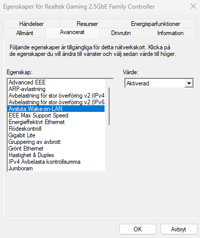
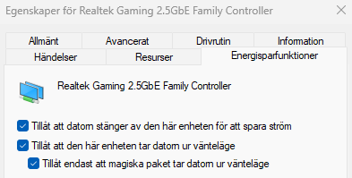

# Säker Fjärråtkomst till Ditt Hemmanätverk med WireGuard

Denna guide beskriver hur man sätter upp en privat VPN-server för att etablera säker fjärråtkomst till det lokala nätverket. Valet av protokoll har fallit på **WireGuard**, vilket är ett modernt och strömlinjeformat VPN-protokoll som erbjuder markant snabbare uppkoppling och högre genomströmning jämfört med äldre lösningar.

WireGuard använder nyckelpar för autentisering. Även om detta ger en enklare implementering, kan ytterligare säkerhetsåtgärder implementeras efter att den grundläggande VPN-funktionaliteten är driftsatt.

---

## Projektets Mål: Högpresterande Fjärrverkstad

Huvudsyftet med installationen är att möjliggöra fjärråtkomst till en kraftfull stationär hemdator från en extern plats. Detta är idealiskt för användare vars bärbara datorers prestanda är otillräcklig för krävande uppgifter, såsom körning av flera virtuella maskiner i nätverksbyggande eller utvecklingsmiljöer.

Genom att installera WireGuard-servern på en **Raspberry Pi** kan den stationära datorns fulla kapacitet utnyttjas på distans.

### Fjärranslutningskedjan
Efter etablerad VPN-anslutning följs en effektiv fjärråtkomstkedja:

1.  **SSH-åtkomst** till Raspberry Pi:n (VPN-gatewayen).
2.  **Wake-on-LAN (WoL)** används från Pi:n för att starta den stationära datorn.
3.  **Remote Desktop Protocol (RDP)** används för att fjärrstyra och arbeta på datorn.

Denna guide ger en stegvis metod för att implementera denna säkra och högpresterande fjärråtkomstlösning.

---

## Steg 1: Förberedelse av Raspberry Pi-servern

VPN-servern kommer att etableras på en Raspberry Pi 5. Denna plattform är idealisk för att agera som en dedikerad och resurssnål VPN-gateway.

* **Hårdvara:** En Raspberry Pi 5 används som värd för WireGuard.
* **Minneskort:** För optimal prestanda rekommenderas ett minneskort med **A2-klassning**.

### Installation av Operativsystemet
För att förbereda systemet måste operativsystemet (OS) skrivas till minneskortet.

1.  **Installera Imager:** Ladda ner och installera [Raspberry Pi Imager](https://www.raspberrypi.com/software/) på din arbetsdator.
2.  **Skriv OS:** Använd Imager för att välja **Raspberry Pi OS 64-bit** och skriv det till minneskortet.
3.  **Initial Uppstart:** När processen är klar, sätt in minneskortet i din Raspberry Pi 5 och utför den första uppstarten med en ansluten skärm, tangentbord och mus.

---

## Steg 2: Installation och Konfiguration av PiVPN (WireGuard)

Efter den initiala uppstarten av Raspberry Pi är nästa steg att installera och konfigurera PiVPN. Detta skript underlättar installationen av WireGuard-servern.

### Serverinstallation
Anslut till Raspberry Pi:n antingen via SSH från en annan nätverksansluten dator eller direkt genom att använda ansluten skärm, tangentbord och mus. Utför därefter följande kommandon i terminalen:

**Systemuppdatering:**
```bash
sudo apt update && sudo apt upgrade -y
```

**Installera PiVPN:**
Ladda ner och kör installationsskriptet för PiVPN.
```bash
curl -L [https://install.pivpn.io](https://install.pivpn.io) | bash
```

### Genomför PiVPN-guiden
Följ instruktionerna i det interaktiva PiVPN-installationsverktyget:

* **Statisk IP-adress:** Vid uppmaning, ange samma IP-adress som Raspberry Pi:n har tilldelats via DHCP för att förhindra adresskonflikter.
* **Välj VPN-protokoll:** Välj **WireGuard**.
* **Port:** Använd standardporten för WireGuard: **51820**.
* **Omstart:** Efter slutförd konfiguration, välj att starta om Raspberry Pi:n.

### Generera Klientnycklar
När servern har startat om måste du generera konfigurationsfiler (`.conf`) för de enheter som ska ansluta till VPN:et (klienterna).

**Skapa nyckelpar:**
Kör kommandot för att lägga till en ny klient. Ange ett beskrivande namn för nyckeln (t.ex. laptop eller mobil).
```bash
pivpn add
```

**Leta upp konfigurationsfilen:**
Den genererade `.conf`-filen ligger nu i mappen `/configs`. Kontrollera filen med följande kommando (ersätt `"user"` med ditt användarnamn):
```bash
ls /home/"user"/configs
```

---

## Steg 3: Nätverkskonfiguration (Router)

För att VPN-servern ska vara åtkomlig från internet krävs det att en korrekt nätverkskonfiguration upprättas i routern.

### IP-adresssäkerställande
Det är avgörande att servern har en permanent IP-adress i det lokala nätverket. Detta kan uppnås på ett av följande sätt:
* Ställ in manuell statisk IP-adress direkt på Raspberry Pi:n.
* Reservera DHCP-adressen i routern, vilket säkerställer att Pi:n alltid tilldelas samma lokala IP-adress.

### Port Forwarding
Ställ in Port Forwarding i routern. Trafik som kommer in på den externa VPN-porten måste omdirigeras till Raspberry Pi:ns permanenta lokala IP-adress.

* **Protokoll:** UDP
* **Extern/Intern Port:** 51820
* **Destination:** Den permanenta IP-adressen för Raspberry Pi:n.

  

Denna åtgärd möjliggör att VPN-klienter utanför hemnätverket kan ansluta till WireGuard-servern.

---

## Steg 4: Konfigurering av Fjärrskrivbord (RDP)

När VPN-tunneln är etablerad är nästa steg att säkerställa att den stationära datorn kan fjärrstyras via WireGuard-anslutningen. Detta kräver aktivering av RDP (Remote Desktop Protocol) och hantering av potentiella autentiseringsproblem.

### Utmaning: Microsoft-konton
Vid användning av Windows Fjärrskrivbord (RDP) uppstår ofta autentiseringsproblem vid inloggning med Microsoft-konton (e-postadresser som användarnamn). Detta kan leda till återkommande inloggnings- och behörighetsfel.

### Lösning: Skapa ett Lokalt Administratörskonto
För att garantera en smidig och pålitlig RDP-anslutning krävs ett lokalt konto:

1.  **Skapa Lokalt Konto:** Skapa ett nytt lokalt användarkonto på den stationära datorn (t.ex. `LokaltKontoJacob`).
2.  **Tilldela Administratörsbehörighet:** Lägg till det nya lokala kontot i gruppen **Administratörer** via *Datorhantering* (Computer Management).
    * *Alternativt* kan kontot läggas till i gruppen *Användare av Fjärrskrivbord*, men administratörsbehörighet förenklar behörighetshanteringen.
3.  **Konsolidera Data:** Flytta över nödvändiga program, inställningar och data från det gamla Microsoft-kontot till det nya lokala kontot.

Genom att övergå till ett lokalt administratörskonto elimineras de vanliga autentiseringsproblemen vid RDP och det säkerställs att ett enda, fullt behörigt konto används för både lokal användning och fjärrstyrning.


---

## Steg 5: Aktivering av Wake-on-LAN (WoL) och SSH

För att fullborda fjärråtkomstlösningen måste den stationära datorn kunna väckas på distans, och Raspberry Pi:n måste vara åtkomlig via SSH.

### 🔌 Konfigurering av WoL på Stationär Dator
WoL kräver inställningar i både datorns firmware och operativsystem:

* **BIOS/UEFI:** Gå in i datorns BIOS/UEFI och aktivera funktionen *Power on by PCI-E* (eller motsvarande nätverksrelaterad ströminställning).
* **Enhetshanteraren (Windows):** I datorns enhetshanterare, navigera till nätverkskortets egenskaper.
    * Under fliken **Avancerat** (Advanced), säkerställ att inställningarna för *Wake-on-LAN* och *Vakna vid magiskt paket* (Magic Packet) är aktiverade.
    * Under fliken **Energisparfunktioner** (Power Management), tillåt att enheten får starta datorn med ett magiskt paket.



### Implementering av WoL och SSH på Raspberry Pi
Raspberry Pi:n agerar som WoL-klient och SSH-server.

**1. Installera WoL-verktyg:**
Installera `wakeonlan`-verktyget på Raspberry Pi:n via terminalen:
```bash
sudo apt install wakeonlan -y
```

**2. Väck Datorn:**
Hämta den stationära datorns MAC-adress (t.ex. `11:22:33:44:55:66`). Datorn kan nu startas med kommandot:
```bash
wakeonlan <MAC-adress>
```

**3. Aktivera SSH:**
Aktivera och starta SSH-tjänsten på Raspberry Pi:n för fjärrstyrning av servern:
```bash
sudo systemctl enable ssh
sudo systemctl start ssh
```

### Fjärranslutning via SSH
Efter att VPN-anslutningen är upprättad, kan Raspberry Pi:n nås säkert via tunnelns IP-adress:

**Anslutning:**
Använd en kommandotolk (t.ex. CMD) på din bärbara dator och logga in med Raspberry Pi-användarens kontonamn (`jacob` i detta exempel) och VPN-tunnelns IP-adress (t.ex. `10.9.109.1`).

```bash
ssh jacob@10.9.109.1
```


## Steg 6: Slutförande av Fjärranslutningen

När alla komponenter är konfigurerade kan den fullständiga anslutningskedjan användas för att arbeta på den stationära datorn från valfri plats.

### Arbetsflöde vid användning

1.  **Anslut till VPN:** Starta **WireGuard**-klienten på den bärbara datorn och anslut till hemmanätverket.
2.  **Fjärrstarta via SSH:** Öppna en terminal och anslut till din Raspberry Pi via **SSH**. Skicka det "magiska paketet" för att starta den stationära datorn:
    ```bash
    wakeonlan <MAC-adress>
    ```
3.  **Vänta lite:** Vänta i cirka 30 till 60 sekunder. Tiden varierar beroende på den stationära datorns uppstartstid och nätverksinitiering.
4.  **Anslut med RDP:** Öppna programmet **Anslutning till fjärrskrivbord** **RDP** på den bärbara datorn. Ange den stationära datorns lokala IP-adress och logga in med det lokala administratörskontot.

### Resultat

Den här lösningen gör att man inte längre behöver begränsas av den bärbara datorns hårdvara när kraften inte räcker till. Oavsett var man befinner sig går det att utnyttja den stationära datorns fulla kraft för krävande uppgifter – som att köra tunga nätverkssimuleringar eller flera virtuella maskiner samtidigt.
